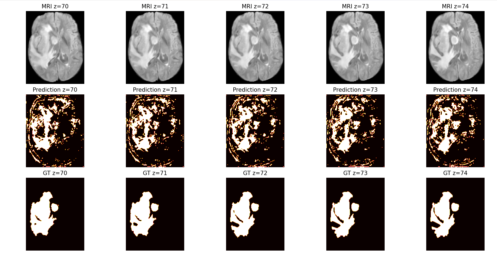

#SemiSAM+: Rethinking Semi-Supervised Medical Image Segmentation in the Era of
Foundation Models
SemiSAM+ là mô hình học bán giám sát cho bài toán phân đoạn ảnh y tế 3D, kết hợp giữa phương pháp Mean Teacher và nhánh SAM (Segment Anything Model) để regular hóa đầu ra và cải thiện tính nhất quán cho dữ liệu không gán nhãn.
## Mục tiêu
- Nâng cao hiệu quả phân đoạn trong điều kiện dữ liệu gán nhãn khan hiếm
- Kết hợp các chiến lược:
  - Consistency regularization (Mean Teacher)
  - Uncertainty masking
  - DAN (Discriminator Adversarial Network)

---
##  Tính năng
Phân đoạn bán giám sát: Tận dụng dữ liệu không được gán nhãn một cách hiệu quả để nâng cao hiệu suất phân đoạn.
Tích hợp SAM: Kết hợp kiến trúc của Segment Anything Model (SAM) để phân đoạn đối tượng mạnh mẽ.

##  Cài đặt 
Để chạy SemiSAM+, làm theo các bước sau :

Yêu cầu :
* Python 3.8
* Pytorch
* CUDA

Bước 1 : Clone kho lưu trữ
Tạo một folders 
git clone https://github.com/nguyenducmanh-itus/SemiSAM-Segment-Medical-Image.git
Bước 2 : Tạo môi trường ảo cho python 3.8
Đường dẫn đến python3.8/python.exe -m venv myenv38
source myenv38\Scripts\activate
Bước 3 : Cài đặt các gói phụ thuộc
pip install -r requirements.txt

## Chạy chương trình 
1.Chuẩn bị dữ liệu 
Tải tệp dữ liệu BraTS19 ở đường link sau : https://drive.google.com/drive/u/1/folders/1qjAKJ2ZYm2mC9TTbXP3NTaVKoaNclVSG 
và đưa vào thư mục data\ đã clone về trong project.
2.Tải trọng số cho mô hình SAM
Tải trọng số đã được huấn luyện từ trước cho mô hình SAM ở đây : https://drive.google.com/file/d/1MuqYRQKIZb4YPtEraK8zTKKpp-dUQIR9/view
và tạo một thư mục tên ckpt cùng cấp với code_semisam+ và đổi tên file trọng số đã tạo thành : sam_med3d.pth và đưa vào ckpt\
3.Huấn luyện mô hình
Triển khai các mô hình chuyên gia
# Training
cd code_semisam+
python SemiSAM_train_MT_3D.py --prompt [unc/point/mask]
python SemiSAM_train_UAMT_3D.py --prompt [unc/point/mask]
python SemiSAM_train_DAN_3D.py --prompt [unc/point/mask]
# Testing
python test_LA.py

## Kết quả
Sau khi huấn luyện các mô hình chuyên gia các các thông tin về mô hình như :
* Quá trình huấn luyện : Loss, Độ đo sẽ được lưu trong thư mục model\BraTS\...\log.txt 
* Trọng số tốt nhất của mô hình được lưu trong thư mục model\BraTS\...\unet_3D_best_model.pth

## Trực quan hóa kết quả
Để xem hình ảnh đầu vào và các dự đoán của mô hình so với dự đoán thật chạy lệnh :
# show result
python inference.py
# Ví dụ trực quan hóa ảnh đầu vào, kết quả phân đoạn và ground-truth của mô hình MT

